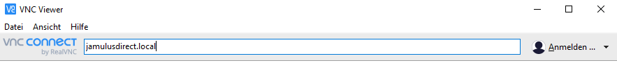
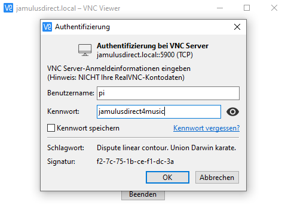
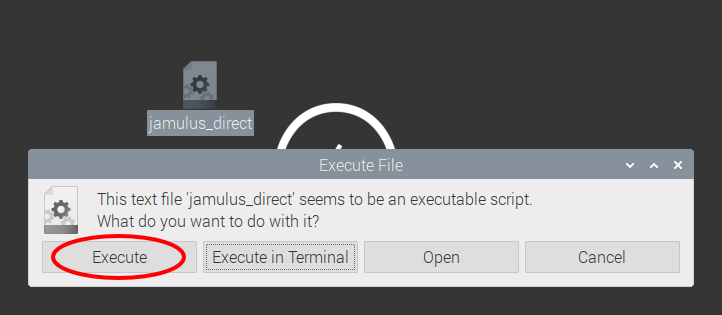

# Jamulus-Direct
**Jamulus-Direct** is a peer-to-peer audio conferencing software run on a RaspberryPi 4 with a U-Phoria UM2 Behringer USB interface.


[](https://www.zhaw.ch/en/engineering/institutes-centres/ines/ "Homepage")

__The group High Performance Multimedia from the Institute of Embedded Systems associated with ZHAW School of Engineering proudly presents a peer-to-peer version of the popular music performance software Jamulus.__

Jamulus is an open-source software for online music sessions. Especially with the pandemic hiting the world, Jamulus is a great solution for bands and choirs to rehearse together from home over the internet. The website of Jamulus can be found at https://jamulus.io/.

We are big fans of Jamulus and wanted to add peer-to-peer audio communication. Jamulus-Direct is the result of this effort.

## About Jamulus-Direct
**Jamulus-Direct** is a modified version of Jamulus with a peer-to-peer audio functionality. The peer-to-peer structure can lower audio latencies between clients. The software is inteded for musical groups that want to rehearse together. The person who opens a session, shares the session name with his/her peers, so they can connect to the opened session. Opened sessions are not displayed in a public list.

**Jamulus-Direct** is designed to be run on a Raspberry Pi 4 with a U-Phoria UM2 Behringer USB audio Interface.    
To test it out, you can either use our prepared [image](https://download.unmute.ch/jamulus_direct_v1_beta.img.gz ) or install **Jamulus-Direct** on a already running Raspberry Pi. Both options are explained in more details below.   

- [Setup Jamulus-Direct Image on a RaspberryPi](#Setup-Jamulus-Direct-Image-on-a-RaspberryPi)
- [Install Jamulus-Direct on an already running RaspberryPi](#Install-Jamulus-Direct-on-an-already-running-RaspberryPi)


# Setup Jamulus-Direct Image on a RaspberryPi
- [1 Write SD Card](#Write-SD-card)    
- [2 Connect to RaspberryPi with VNC Viewer](#Connect-to-RaspberryPi-with-VNC-Viewer)    

------------------------------------------------

## Write SD card
Download the **Jamulus-Direct** Image from our server: https://download.unmute.ch/jamulus_direct_v1_beta.img.gz 

Write the image on an SD Card. For this you can use the RaspberryPi Imager: https://www.raspberrypi.org/downloads/

After installing the RaspberryPi Imager, start the application. In "CHOOSE OS" select "Use custom" and then find the downloaded image.

When the imager is done, remove the SD card from the computer and put it into the RaspberryPi.

Boot the RaspberryPi.

## Connect to RaspberryPi with VNC Viewer
To use the RaspberryPi, one can simply connect a display, keyboard and mouse to the Pi. But since this setup is not very handy, we suggest connecting to the RaspberryPi with VNC Viewer. VNC Viewer can be installed on a Laptop/Computer with Windows, MacOS and Linux (https://www.realvnc.com/de/connect/download/viewer/). Or install it on your phone over the App Store on Android or iOS. The device you choose to connect with, needs to be in the same network as the RaspberryPi.

To connect to the RaspberryPi with VNC viewer, enter `jamulusdirect.local`. The VNC viewer should find the RaspberryPi by this hostname.



To login use:
- User: pi
- Password: jamulusdirect4music



If the VNC Viewer cannot find the hostname `jamulusdirect.local`then do the following:
- On Windows: Install and run Bonjour Print Services https://support.apple.com/kb/DL999?locale=en_US
- Linux: In a terminal run: `ping jamulusdirect.local`. The ping command shows the IP of jamulusdirect.local. In VNC Viewer, use this IP to connect.
- Android Phone: Install and run BonjourBrowser Application from the Play Store. When scanning your network with the BonjourBrowser, it should show you the IP of your RaspberryPi. In VNC Viewer, use this IP to connect.

When you are logged in, for security, change the password of the RaspberryPi.   
Click Raspberry Symbol on top left -> Preferences -> Raspberry Pi Configuration -> Change Password


## Run Jamulus-Direct
Tor run **Jamulus-Direct**, double-click the file called **Jamulus-Direct** on the desktop. Then you can choose either "Execute" or "Execute in Terminal". Running it in terminal can be useful to get the application debug output, if something is not working.



The first window that opens up lets you choose your name and the name of the session. If you are opening the session, press "Open". If your peer has already opened a session, than enter his/her session name and press "Connect to Session". 

# Install Jamulus-Direct on an already running RaspberryPi

## Install and Run Jamulus-Direct
Download the **Jamulus-Direct** source code and run the raspijamulus script to build **Jamulus-Direct** and its dependencies:
```
git clone https://github.com/InES-HPMM/jamulus_direct.git
cd ~/jamulus_direct/distributions
./raspijamulus.sh
```
In the future to run jamulus just execute the jamulus_direct.sh with sudo privileges:
```
cd ~/jamulus_direct/distributions
sudo ./jamulus_direct.sh
```

